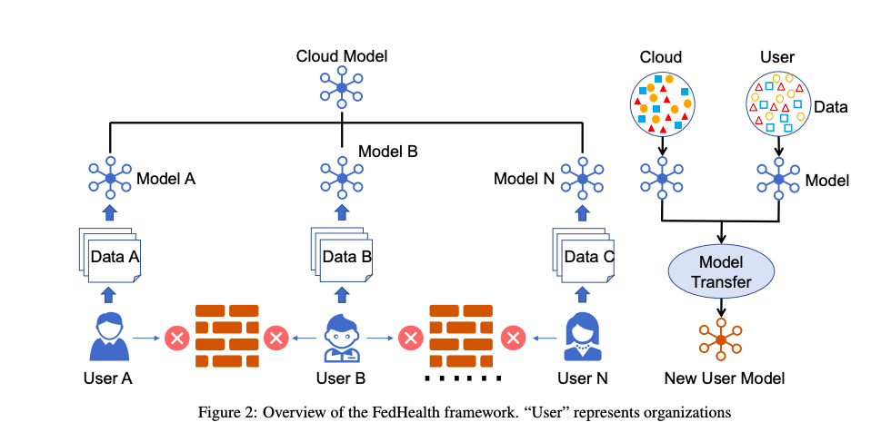

# Awesome Healthcare Federated Learning

Federated learning, a mechanism of training a shared global model with a central server while keeping all the sensitive data in local institutions where the data belong, provides great promise to connect the fragmented healthcare data sources with privacy-preservation. This repo contains a curated list of Federated Learning papers/resources and recent advancements in Healthcare.

  

# Contribute

We welcome contributions to this list! In fact, that's the main reason why I created it - to encourage contributions and encourage people to subscribe to changes in order to stay informed about new and exciting developments in the world of Heathcare Federated Learning.

Need help in

- Classify the paper into appropriate categories such as [ Survey, Experiment, New Algorithm etc]
- Sort the paper based on publication year
- Add new papers to update the list

Thank you for your interest in contributing to this project!

##### Table of Contents

1. [Papers](#FL-papers)  
2. [Code](#Code)
3. [datasets](#Datasets)
4. [Tutorials](#Tutorials)
5. [Researchers](#Researchers)

## Code

- **Tensorflow Federated** 
  - [[Code]](https://github.com/tensorflow/federated)
  
- **An Industrial Grade Federated Learning Framework**
  - [[Code]](https://github.com/FederatedAI/FATE)
  
- **Flower - A Friendly Federated Learning Framework**
  - [[Code]](https://github.com/adap/flower)
  
- **Data science on data without acquiring a copy**
  - [[Code]](https://github.com/OpenMined/PySyft)
 
  
## Tutorials

- **Federated Learning on Mobile**
  - [[Course]](https://courses.openmined.org/courses/federated-learning-on-mobile)
  
- **Federated Learning with Google**
  - [[Course]](https://federated.withgoogle.com/)

## Papers

### Survey

- **Federated learning for healthcare informatics**
  - Jie Xu, Benjamin S. Glicksberg, Chang Su, Peter Walker, Jiang Bian, Fei Wang
  - [[Paper]](https://arxiv.org/abs/1911.06270)
  
- **The future of digital health with federated learning**
  - Nicola Rieke
  - [[Paper]](https://www.nature.com/articles/s41746-020-00323-1)

- **Federated Learning for Healthcare Domain - Pipeline, Applications and Challenges**
  - Madhura Joshi , Ankit Pal , Malaikannan Sankarasubbu
  - [[Paper]](https://dl.acm.org/doi/10.1145/3533708)
  
  
 - **Federated Learning for Healthcare Informatics1** 
  - [[Paper]](https://www.ncbi.nlm.nih.gov/pmc/articles/PMC7659898/) 

- **AI in Health: State of the Art, Challenges, and Future Directions** 
  - [[Paper]](https://www.ncbi.nlm.nih.gov/pmc/articles/pmid/31419814/) 

- **Artificial Intelligence in Primary Health Care: Perceptions, Issues, and Challenges** 
  - [[Paper]](https://www.ncbi.nlm.nih.gov/pmc/articles/PMC6697547/) 

- **Systematic Review of Privacy-Preserving Distributed Machine Learning From Federated Databases in Health Care** 
  - [[Paper]](https://www.ncbi.nlm.nih.gov/pmc/articles/PMC7113079/) 
  
- **Open-Source Federated Learning Frameworks for IoT: A Comparative Review and Analysis** 
  - [[Paper]](https://www.ncbi.nlm.nih.gov/pmc/articles/PMC7794892/) 
  
 
 ### Covid-19
 
 - **Federated Learning of Electronic Health Records Improves Mortality Prediction in Patients Hospitalized with COVID-19** 
  - [[Paper]](https://www.medrxiv.org/content/10.1101/2020.08.11.20172809v1.full-text) 
  
 - **Federated semi-supervised learning for COVID region segmentation in chest CT using multi-national data from China, Italy, Japan** 
  - [[Paper]](https://www.ncbi.nlm.nih.gov/pmc/articles/PMC7864789/)
  
  
    
- **Collaborative Federated Learning For Healthcare: Multi-Modal COVID-19 Diagnosis at the Edge** 
  - [[Paper]](https://arxiv.org/pdf/2101.07511.pdf)
  
  
- **The value of federated learning during and post-COVID-19** 
  - [[Paper]](https://www.ncbi.nlm.nih.gov/pmc/articles/PMC7928850/)
  
- **SCOR: A secure international informatics infrastructure to investigate COVID-19** 
  - [[Paper]](https://www.ncbi.nlm.nih.gov/pmc/articles/PMC7454652/) 
  
- **Real-Time Electronic Health Record Mortality Prediction During the COVID-19 Pandemic: A Prospective Cohort Study** 
  - [[Paper]](https://www.medrxiv.org/content/10.1101/2021.01.14.21249793v1.full-text)

- **COVID-19 IMAGING DATA PRIVACY BY FEDERATED LEARNING DESIGN: A THEORETICAL FRAMEWORK** 
  - [[Paper]](https://arxiv.org/pdf/2010.06177.pdf)

- **Artificial intelligence in COVID-19 drug repurposing** 
  - [[Paper]](https://www.thelancet.com/pdfs/journals/landig/PIIS2589-7500(20)30192-8.pdf) 

- **Blockchain-Federated-Learning and Deep Learning Models for COVID-19 detection using CT Imaging** 
  - [[Paper]](https://arxiv.org/pdf/2007.06537.pdf) 

- **Experiments of Federated Learning for COVID-19 Chest X-ray Images** 
  - [[Paper]](https://arxiv.org/pdf/2007.05592.pdf) 
  
 
 
### Experiments
  
- **Federated Learning on Clinical Benchmark Data: Performance Assessment**
  - Geun Hyeong Lee and Soo-Yong Shin
  - [[Paper]](https://www.ncbi.nlm.nih.gov/pmc/articles/PMC7652692/)
  
- **Secure and Robust Machine Learning for Health Care**
  - Adnan Qayyum, Junaid Qadir, Muhammad Bilal, Ala Al-Fuqaha
  - [[Paper]](https://arxiv.org/abs/2001.08103)
  
- **Privacy-first health research with federated learning** 
  - [[Paper]](https://www.medrxiv.org/content/10.1101/2020.12.22.20245407v1.full-text) 

- **Patch-Based Surface Morphometry Feature Selection with Federated Group Lasso Regression** 
  - [[Paper]](https://www.ncbi.nlm.nih.gov/pmc/articles/PMC7694696/) 

- **Predicting Adverse Drug Reactions on Distributed Health Data using Federated Learning** 
  - [[Paper]](https://www.ncbi.nlm.nih.gov/pmc/articles/PMC7153050/) 

- **Federated electronic health records research technology to support clinical trial protocol optimization: Evidence from EHR4CR and the InSite platform** 
  - [[Paper]](https://www.sciencedirect.com/science/article/pii/S1532046418302314?via%3Dihub) 

- **Probabilistic Predictions with Federated Learning** 
  - [[Paper]](https://www.ncbi.nlm.nih.gov/pmc/articles/PMC7823259/) 

- **Using federated data sources and Varian Learning Portal framework to train a neural network model for automatic organ segmentation** 
  - [[Paper]](https://www.physicamedica.com/article/S1120-1797(20)30065-X/fulltext) 

- **Federated Reinforcement Learning for Training Control Policies on Multiple IoT Devices** 
  - [[Paper]](https://www.ncbi.nlm.nih.gov/pmc/articles/PMC7085801/) 

- **Lazily Aggregated Quantized Gradient Innovation for Communication-Efficient Federated Learning** 
  - [[Paper]](https://papers.nips.cc/paper/2018/file/feecee9f1643651799ede2740927317a-Paper.pdf) 

- **Privacy-preserving model learning on a blockchain network-of-networks** 
  - [[Paper]](https://www.ncbi.nlm.nih.gov/pmc/articles/PMC7025358/) 

- **Privacy-Preserving Methods for Feature Engineering Using Blockchain: Review, Evaluation, and Proof of Concept** 
  - [[Paper]](https://www.ncbi.nlm.nih.gov/pmc/articles/PMC6712958/) 

- **Healthchain: A novel framework on privacy preservation of electronic health records using blockchain technology** 
  - [[Paper]](https://www.ncbi.nlm.nih.gov/pmc/articles/PMC7725426/) 

- **Privacy-Preserving in Healthcare Blockchain Systems Based on Lightweight Message Sharing** 
  - [[Paper]](https://www.ncbi.nlm.nih.gov/pmc/articles/PMC7180853/) 

- **MedBlock: Efficient and Secure Medical Data Sharing Via Blockchain** 
  - [[Paper]](https://link.springer.com/article/10.1007%2Fs10916-018-0993-7) 

- **Blockchain distributed ledger technologies for biomedical and health care applications** 
  - [[Paper]](https://www.ncbi.nlm.nih.gov/pmc/articles/PMC6080687/) 

- **A Decentralized Privacy-Preserving Healthcare Blockchain for IoT** 
  - [[Paper]](https://www.ncbi.nlm.nih.gov/pmc/articles/PMC6359727/) 

- **Joint Imaging Platform for Federated Clinical Data Analytics** 
  - [[Paper]](https://ascopubs.org/doi/10.1200/CCI.20.00045?url_ver=Z39.88-2003&rfr_id=ori%3Arid%3Acrossref.org&rfr_dat=cr_pub++0pubmed&) 

- **Federated Transfer Learning for EEG Signal Classification** 
  - [[Paper]](https://arxiv.org/pdf/2004.12321.pdf) 

- **Federated Learning used for predicting outcomes in SARS-COV-2 patients** 
  - [[Paper]](https://www.ncbi.nlm.nih.gov/pmc/articles/PMC7805458/) 

- **Large-Scale Water Quality Prediction Using Federated Sensing and Learning: A Case Study with Real-World Sensing Big-Data** 
  - [[Paper]](https://www.ncbi.nlm.nih.gov/pmc/articles/PMC7923429/) 

- **Multi-site fMRI analysis using privacy-preserving federated learning and domain adaptation: ABIDE results** 
  - [[Paper]](https://reader.elsevier.com/reader/sd/pii/S1361841520301298?token=49EC74DDB6FB2CAE2701353194B68C2D3ED8687C6D0C7674CCAFE61148A2E304204AF7863116946239671695D825D2C4) 

- **Federated learning in medicine: facilitating multi-institutional collaborations without sharing patient data** 
  - [[Paper]](https://www.ncbi.nlm.nih.gov/pmc/articles/PMC7387485/) 

- **Security and privacy requirements for a multi-institutional cancer research data grid: an interview-based study** 
  - [[Paper]](https://www.ncbi.nlm.nih.gov/pmc/articles/PMC2709611/) 

- **Federated learning of predictive models from federated Electronic Health Records** 
  - [[Paper]](https://www.ncbi.nlm.nih.gov/pmc/articles/PMC5836813/) 

- **Creating a data exchange strategy for radiotherapy research: towards federated databases and anonymised public datasets** 
  - [[Paper]](https://www.ncbi.nlm.nih.gov/pmc/articles/PMC4648243/) 

- **Stochastic Channel-Based Federated Learning With Neural Network Pruning for Medical Data Privacy Preservation: Model Development and Experimental Validation** 
  - [[Paper]](https://www.ncbi.nlm.nih.gov/pmc/articles/PMC7909896/) 

- **Balancing Accuracy and Privacy in Federated Queries of Clinical Data Repositories: Algorithm Development and Validation** 
  - [[Paper]](https://www.ncbi.nlm.nih.gov/pmc/articles/PMC7671849/) 

- **A collaborative framework for Distributed Privacy-Preserving Support Vector Machine learning** 
  - [[Paper]](https://www.ncbi.nlm.nih.gov/pmc/articles/PMC3540462/) 

- **Privacy-Preserving Deep Learning for the Detection of Protected Health Information in Real-World Data: Comparative Evaluation** 
  - [[Paper]](https://www.ncbi.nlm.nih.gov/pmc/articles/PMC7238077/) 

- **A review on the state-of-the-art privacy-preserving approaches in the e-health clouds** 
  - [[Paper]](https://silo.tips/download/a-review-on-the-state-of-the-art-privacy-preserving-approaches-in-the-e-health-c) 

- **eHealth Cloud Security Challenges: A Survey** 
  - [[Paper]](https://www.ncbi.nlm.nih.gov/pmc/articles/PMC6745146/) 

- **Infrastructure and distributed learning methodology for privacy-preserving multi-centric rapid learning health care: euroCAT** 
  - [[Paper]](https://www.ncbi.nlm.nih.gov/pmc/articles/PMC5833935/) 

- **Developing and Validating a Survival Prediction Model for NSCLC Patients Through Distributed Learning Across 3 Countries** 
  - [[Paper]](https://www.ncbi.nlm.nih.gov/pmc/articles/PMC5575360/) 

- **Distributed learning: Developing a predictive model based on data from multiple hospitals without data leaving the hospital - A real life proof of concept** 
  - [[Paper]](https://www.thegreenjournal.com/article/S0167-8140(16)34336-5/fulltext) 

- **How Should Health Data Be Used?** 
  - [[Paper]](https://bioethics.yale.edu/sites/default/files/files/ISPS14-025.pdf) 

- **Data-driven modeling and prediction of blood glucose dynamics: Machine learning applications in type 1 diabetes** 
  - [[Paper]](https://www.sciencedirect.com/science/article/pii/S0933365717306218?via%3Dihub) 

- **Building machine learning models without sharing patient data: A simulation-based analysis of distributed learning by ensembling** 
  - [[Paper]](https://sci-hub.mksa.top/10.1016/j.jbi.2020.103424) 

- **A comparative evaluation of the generalised predictive ability of eight machine learning algorithms across ten clinical metabolomics data sets for binary classification** 
  - [[Paper]](https://www.ncbi.nlm.nih.gov/pmc/articles/PMC6856029/) 

- **Multi-center machine learning in imaging psychiatry: A meta-model approach** 
  - [[Paper]](https://sci-hub.mksa.top/10.1016/j.neuroimage.2017.03.027) 

- **A comparison of machine learning methods for classification using simulation with multiple real data examples from mental health studies** 
  - [[Paper]](https://www.ncbi.nlm.nih.gov/pmc/articles/PMC5081132/) 

- **Distributed deep learning networks among institutions for medical imaging** 
  - [[Paper]](https://www.ncbi.nlm.nih.gov/pmc/articles/PMC6077811/) 

- **The anatomy of a distributed predictive modeling framework: online learning, blockchain network, and consensus algorithm** 
  - [[Paper]](https://www.ncbi.nlm.nih.gov/pmc/articles/PMC7382618/) 

- **WebDISCO: a web service for distributed cox model learning without patient-level data sharing** 
  - [[Paper]](https://www.ncbi.nlm.nih.gov/pmc/articles/PMC5009917/) 

- **Differentially Private Distributed Online Learning** 
  - [[Paper]](https://www.ncbi.nlm.nih.gov/pmc/articles/PMC6764830/) 

- **An Uplink Communication-Efficient Approach to Featurewise Distributed Sparse Optimization With Differential Privacy** 
  - [[Paper]](https://sci-hub.mksa.top/10.1109/tnnls.2020.3020955) 

- **A Comprehensive Comparison of Multiparty Secure Additions with Differential Privacy** 
  - [[Paper]](https://www.ncbi.nlm.nih.gov/pmc/articles/PMC5598559/) 

- **Secure Multiparty Quantum Computation for Summation and Multiplication** 
  - [[Paper]](https://www.ncbi.nlm.nih.gov/pmc/articles/PMC4726197/) 

- **Hybrid Quantum Protocols for Secure Multiparty Summation and Multiplication** 
  - [[Paper]](https://www.ncbi.nlm.nih.gov/pmc/articles/PMC7272455/) 

- **A blockchain-based scheme for privacy-preserving and secure sharing of medical data** 
  - [[Paper]](https://www.ncbi.nlm.nih.gov/pmc/articles/PMC7462555/) 

- **Cost-Efficient and Multi-Functional Secure Aggregation in Large Scale Distributed Application** 
  - [[Paper]](https://www.ncbi.nlm.nih.gov/pmc/articles/PMC4994945/) 

- **Privacy-Enhanced and Multifunctional Health Data Aggregation under Differential Privacy Guarantees** 
  - [[Paper]](https://www.ncbi.nlm.nih.gov/pmc/articles/PMC5038741/) 

- **Security issues in healthcare applications using wireless medical sensor networks: a survey** 
  - [[Paper]](https://www.ncbi.nlm.nih.gov/pmc/articles/PMC3279202/) 

- **A secure distributed logistic regression protocol for the detection of rare adverse drug events** 
  - [[Paper]](https://www.ncbi.nlm.nih.gov/pmc/articles/PMC3628043/) 

- **High performance logistic regression for privacy-preserving genome analysis** 
  - [[Paper]](https://www.ncbi.nlm.nih.gov/pmc/articles/PMC7818577/) 

- **Efficient Privacy-Preserving Access Control Scheme in Electronic Health Records System** 
  - [[Paper]](https://www.ncbi.nlm.nih.gov/pmc/articles/PMC6210245/) 

- **Privacy-Preserving Analysis of Distributed Biomedical Data: Designing Efficient and Secure Multiparty Computations Using Distributed Statistical Learning Theory** 
  - [[Paper]](https://www.ncbi.nlm.nih.gov/pmc/articles/PMC6658266/) 

- **Learning from electronic health records across multiple sites: A communication-efficient and privacy-preserving distributed algorithm** 
  - [[Paper]](https://www.ncbi.nlm.nih.gov/pmc/articles/PMC7025371/) 

- **DPSynthesizer: Differentially Private Data Synthesizer for Privacy Preserving Data Sharing** 
  - [[Paper]](https://www.ncbi.nlm.nih.gov/pmc/articles/pmid/26167358/) 

- **A flexible approach to distributed data anonymization** 
  - [[Paper]](https://www.sciencedirect.com/science/article/pii/S1532046413001937?via%3Dihub) 

- **Privacy-preserving data cube for electronic medical records: An experimental evaluation** 
  - [[Paper]](https://sci-hub.mksa.top/10.1016/j.ijmedinf.2016.09.008) 

- **A framework to preserve the privacy of electronic health data streams** 
  - [[Paper]](https://www.sciencedirect.com/science/article/pii/S1532046414000823?via%3Dihub) 

- **Secure and scalable deduplication of horizontally partitioned health data for privacy-preserving distributed statistical computation** 
  - [[Paper]](https://www.ncbi.nlm.nih.gov/pmc/articles/PMC5209873/) 

- **Design and implementation of a privacy preserving electronic health record linkage tool in Chicago** 
  - [[Paper]](https://www.ncbi.nlm.nih.gov/pmc/articles/PMC5009931/) 

- **Privacy preserving interactive record linkage (PPIRL)** 
  - [[Paper]](https://www.ncbi.nlm.nih.gov/pmc/articles/PMC3932473/) 

- **Privacy-preserving record linkage in large databases using secure multiparty computation** 
  - [[Paper]](https://www.ncbi.nlm.nih.gov/pmc/articles/PMC6180364/) 

- **Sample Complexity Bounds for Differentially Private Learning** 
  - [[Paper]](https://www.ncbi.nlm.nih.gov/pmc/articles/PMC4183222/) 

- **Convergence Rates for Differentially Private Statistical Estimation** 
  - [[Paper]](https://www.ncbi.nlm.nih.gov/pmc/articles/PMC4188376/) 

- **Efficient differentially private learning improves drug sensitivity prediction** 
  - [[Paper]](https://www.ncbi.nlm.nih.gov/pmc/articles/PMC5801888/) 

- **A Comprehensive Survey on Local Differential Privacy toward Data Statistics and Analysis** 
  - [[Paper]](https://www.ncbi.nlm.nih.gov/pmc/articles/PMC7763193/) 

- **Privacy-preserving aggregation of personal health data streams** 
  - [[Paper]](https://www.ncbi.nlm.nih.gov/pmc/articles/PMC6264901/) 

- **Efficient and Privacy-Preserving Online Medical Prediagnosis Framework Using Nonlinear SVM** 
  - [[Paper]](https://sci-hub.mksa.top/10.1109/jbhi.2016.2548248) 

- **Privacy-preserving biomedical data dissemination via a hybrid approach** 
  - [[Paper]](https://www.ncbi.nlm.nih.gov/pmc/articles/PMC6371369/) 

- **A community effort to protect genomic data sharing, collaboration and outsourcing** 
  - [[Paper]](https://www.ncbi.nlm.nih.gov/pmc/articles/PMC5677972/) 

- **Privacy challenges and research opportunities for genomic data sharing** 
  - [[Paper]](https://www.ncbi.nlm.nih.gov/pmc/articles/PMC7761157/) 

- **Privacy-Preserving Integration of Medical Data : A Practical Multiparty Private Set Intersection** 
  - [[Paper]](https://www.ncbi.nlm.nih.gov/pmc/articles/PMC5239815/) 

- **Secure multiparty computation for privacy-preserving drug discovery** 
  - [[Paper]](https://sci-hub.mksa.top/10.1093/bioinformatics/btaa038) 

- **Privacy-Preserving Cost-Sensitive Learning** 
  - [[Paper]](https://sci-hub.mksa.top/10.1109/TNNLS.2020.2996972) 

- **Differentially Private Empirical Risk Minimization** 
  - [[Paper]](https://www.ncbi.nlm.nih.gov/pmc/articles/PMC3164588/) 

- **Privacy-preserving heterogeneous health data sharing** 
  - [[Paper]](https://www.ncbi.nlm.nih.gov/pmc/articles/PMC3628047/) 

- **A comprehensive tool for creating and evaluating privacy-preserving biomedical prediction models** 
  - [[Paper]](https://www.ncbi.nlm.nih.gov/pmc/articles/PMC7014648/) 

- **Privacy-enhancing ETL-processes for biomedical data** 
  - [[Paper]](https://www.sciencedirect.com/science/article/pii/S1386505618307007?via%3Dihub) 

- **Privacy-preserving restricted boltzmann machine** 
  - [[Paper]](https://www.ncbi.nlm.nih.gov/pmc/articles/PMC4094866/) 

- **Privacy preserving processing of genomic data: A survey** 
  - [[Paper]](https://www.sciencedirect.com/science/article/pii/S1532046415001100?via%3Dihub) 

- **How (not) to protect genomic data privacy in a distributed network: using trail re-identification to evaluate and design anonymity protection systems** 
  - [[Paper]](https://www.sciencedirect.com/science/article/pii/S153204640400053X?via%3Dihub) 

- **Are privacy-enhancing technologies for genomic data ready for the clinic? A survey of medical experts of the Swiss HIV Cohort Study** 
  - [[Paper]](https://www.sciencedirect.com/science/article/pii/S1532046417302836?via%3Dihub) 

- **Genome privacy: challenges, technical approaches to mitigate risk, and ethical considerations in the United States** 
  - [[Paper]](https://www.ncbi.nlm.nih.gov/pmc/articles/PMC5266631/) 

- **The tension between data sharing and the protection of privacy in genomics research** 
  - [[Paper]](https://www.ncbi.nlm.nih.gov/pmc/articles/PMC4337968/) 

- **ConTPL: Controlling Temporal Privacy Leakage in Differentially Private Continuous Data Release** 
  - [[Paper]](https://www.ncbi.nlm.nih.gov/pmc/articles/PMC6697134/) 

- **New threats to health data privacy** 
  - [[Paper]](https://www.ncbi.nlm.nih.gov/pmc/articles/PMC3247088/) 

- **Securing electronic health records without impeding the flow of information** 
  - [[Paper]](https://sci-hub.mksa.top/10.1016/j.ijmedinf.2006.09.015) 

- **How to Accurately and Privately Identify Anomalies** 
  - [[Paper]](https://www.ncbi.nlm.nih.gov/pmc/articles/PMC6927253/) 

- **A Guide for Private Outlier Analysis** 
  - [[Paper]](https://www.ncbi.nlm.nih.gov/pmc/articles/PMC7423021/) 

- **Privacy-Aware Distributed Hypothesis Testing** 
  - [[Paper]](https://www.ncbi.nlm.nih.gov/pmc/articles/PMC7517198/) 

- **Distributed Hypothesis Testing with Privacy Constraints** 
  - [[Paper]](https://www.ncbi.nlm.nih.gov/pmc/articles/PMC7514967/) 

- **Reliability of Supervised Machine Learning Using Synthetic Data in Health Care: Model to Preserve Privacy for Data Sharing** 
  - [[Paper]](https://www.ncbi.nlm.nih.gov/pmc/articles/PMC7400044/) 

- **Web-Based Privacy-Preserving Multicenter Medical Data Analysis Tools Via Threshold Homomorphic Encryption: Design and Development Study** 
  - [[Paper]](https://www.ncbi.nlm.nih.gov/pmc/articles/PMC7755539/) 

- **A Privacy-Preserving Multi-Task Learning Framework for Face Detection, Landmark Localization, Pose Estimation, and Gender Recognition** 
  - [[Paper]](https://www.ncbi.nlm.nih.gov/pmc/articles/PMC6971161/) 

- **Privacy-enhanced multi-party deep learning** 
  - [[Paper]](https://sci-hub.mksa.top/10.1016/j.neunet.2019.10.001) 

- **Federated Learning: A Survey on Enabling Technologies, Protocols, and Applications** 
  - [[Paper]](https://www.ncbi.nlm.nih.gov/pmc/articles/PMC7523633/) 

- **Privacy-Preserving Patient Similarity Learning in a Federated Environment: Development and Analysis** 
  - [[Paper]](https://www.ncbi.nlm.nih.gov/pmc/articles/PMC5924379/) 

- **A Critical Evaluation of Privacy and Security Threats in Federated Learning** 
  - [[Paper]](https://www.ncbi.nlm.nih.gov/pmc/articles/PMC7765278/) 

- **Properties of a federated epidemiology query system** 
  - [[Paper]](https://sci-hub.mksa.top/10.1016/j.ijmedinf.2006.05.040) 

- **Advanced and secure architectural EHR approaches** 
  - [[Paper]](https://sci-hub.mksa.top/10.1016/j.ijmedinf.2005.07.017) 

- **Implementing security in a distributed web-based EHCR** 
  - [[Paper]](https://sci-hub.mksa.top/10.1016/j.ijmedinf.2006.09.017) 

- **Health information systems - past, present, future** 
  - [[Paper]](https://sci-hub.mksa.top/10.1016/j.ijmedinf.2005.08.002) 

- **Federated healthcare record server--the Synapses paradigm** 
  - [[Paper]](https://sci-hub.mksa.top/10.1016/s1386-5056(98)00121-x) 

- **The basic principles of the synapses federated healthcare record server** 
  - [[Paper]](https://sci-hub.mksa.top/10.1016/s1386-5056(98)00131-2) 

- **Ternary Compression for Communication-Efficient Federated Learning** 
  - [[Paper]](https://sci-hub.mksa.top/10.1109/tnnls.2020.3041185) 

- **Distributed learning on 20 000+ lung cancer patients - The Personal Health Train** 
  - [[Paper]](https://www.ncbi.nlm.nih.gov/pmc/articles/PMC4677334/) 

- **A Distributed Ensemble Approach for Mining Healthcare Data under Privacy Constraints** 
  - [[Paper]](https://www.thegreenjournal.com/article/S0167-8140(19)33489-9/fulltext) 

- **FeARH: Federated machine learning with Anonymous Random Hybridization on electronic medical records** 
  - [[Paper]](https://www.sciencedirect.com/science/article/abs/pii/S1532046421000642?via%3Dihub) 

- **Smart Medical Information Technology for Healthcare (SMITH)** 
  - [[Paper]](https://www.ncbi.nlm.nih.gov/pmc/articles/PMC6193398/) 

- **Patient clustering improves efficiency of federated machine learning to predict mortality and hospital stay time using distributed electronic medical records** 
  - [[Paper]](https://www.sciencedirect.com/science/article/pii/S1532046419302102?via%3Dihub) 

- **Robust and Communication-Efficient Federated Learning From Non-i.i.d. Data** 
  - [[Paper]](https://sci-hub.mksa.top/10.1109/tnnls.2019.2944481) 

- **Federated Tensor Factorization for Computational Phenotyping** 
  - [[Paper]](https://www.ncbi.nlm.nih.gov/pmc/articles/PMC5652331/) 

- **Cloud-Based Federated Learning Implementation Across Medical Centers** 
  - [[Paper]](https://ascopubs.org/doi/10.1200/CCI.20.00060?url_ver=Z39.88-2003&rfr_id=ori:rid:crossref.org&rfr_dat=cr_pub%20%200pubmed) 

- **ACTION-EHR: Patient-Centric Blockchain-Based Electronic Health Record Data Management for Cancer Care** 
  - [[Paper]](https://www.ncbi.nlm.nih.gov/pmc/articles/PMC7474412/) 

- **Federated learning improves site performance in multicenter deep learning without data sharing** 
  - [[Paper]](https://academic.oup.com/jamia/advance-article/doi/10.1093/jamia/ocaa341/6127556) 

- **Healthcare information exchange system based on a hybrid central/federated model** 
  - [[Paper]](https://sci-hub.mksa.top/10.1109/embc.2014.6943852) 

- **Accelerating Health Data Sharing: A Solution Based on the Internet of Things and Distributed Ledger Technologies** 
  - [[Paper]](https://www.ncbi.nlm.nih.gov/pmc/articles/PMC6592507/) 

- **Communication-Efficient Federated Deep Learning With Layerwise Asynchronous Model Update and Temporally Weighted Aggregation** 
  - [[Paper]](https://sci-hub.mksa.top/10.1109/tnnls.2019.2953131) 

- **The future of digital health with federated learning** 
  - [[Paper]](https://www.ncbi.nlm.nih.gov/pmc/articles/PMC7490367/) 

- **A novel privacy-preserving federated genome-wide association study framework and its application in identifying potential risk variants in ankylosing spondylitis** 
  - [[Paper]](https://sci-hub.mksa.top/10.1093/bib/bbaa090) 

- **Privacy-preserving GWAS analysis on federated genomic datasets** 
  - [[Paper]](https://www.ncbi.nlm.nih.gov/pmc/articles/PMC4699163/) 

- **SAFETY: Secure gwAs in Federated Environment through a hYbrid Solution** 
  - [[Paper]](https://www.ncbi.nlm.nih.gov/pmc/articles/PMC6411680/) 

- **FedPSO: Federated Learning Using Particle Swarm Optimization to Reduce Communication Costs** 
  - [[Paper]](https://www.ncbi.nlm.nih.gov/pmc/articles/PMC7829803/) 

- **Big data from electronic health records for early and late translational cardiovascular research: challenges and potential** 
  - [[Paper]](https://www.ncbi.nlm.nih.gov/pmc/articles/PMC6019015/) 

- **Using big data to improve cardiovascular care and outcomes in China: a protocol for the CHinese Electronic health Records Research in Yinzhou (CHERRY) Study** 
  - [[Paper]](https://www.ncbi.nlm.nih.gov/pmc/articles/PMC5829949/) 

- **Using nationwide ‘big data’ from linked electronic health records to help improve outcomes in cardiovascular diseases: 33 studies using methods from epidemiology, informatics, economics and social science in the ClinicAl disease research using LInked Bespoke studies and Electronic health Records (CALIBER) programme** 
  - [[Paper]](https://pubmed.ncbi.nlm.nih.gov/28151614/) 

- **Distributed clinical data sharing via dynamic access-control policy transformation** 
  - [[Paper]](https://sci-hub.mksa.top/10.1016/j.ijmedinf.2016.02.002) 

- **A secure EHR system based on hybrid clouds** 
  - [[Paper]](https://sci-hub.mksa.top/10.1007/s10916-012-9830-6) 

- **A systematic literature review on security and privacy of electronic health record systems: technical perspectives** 
  - [[Paper]](https://sci-hub.mksa.top/10.1177/183335831504400304) 

- **Security Techniques for the Electronic Health Records** 
  - [[Paper]](https://www.ncbi.nlm.nih.gov/pmc/articles/PMC5522514/) 

- **Advances and current state of the security and privacy in electronic health records: survey from a social perspective** 
  - [[Paper]](https://sci-hub.mksa.top/10.1007/s10916-011-9779-x) 

- **Assuring the privacy and security of transmitting sensitive electronic health information** 
  - [[Paper]](https://www.ncbi.nlm.nih.gov/pmc/articles/PMC2815468/) 

- **Wearable Health Technology and Electronic Health Record Integration: Scoping Review and Future Directions** 
  - [[Paper]](https://www.ncbi.nlm.nih.gov/pmc/articles/PMC6746089/) 

- **Literature on Wearable Technology for Connected Health: Scoping Review of Research Trends, Advances, and Barriers** 
  - [[Paper]](https://www.ncbi.nlm.nih.gov/pmc/articles/PMC6818529/) 

- **Privacy-preserving architecture for providing feedback to clinicians on their clinical performance** 
  - [[Paper]](https://www.ncbi.nlm.nih.gov/pmc/articles/PMC7310252/) 
 
- **FedMed: A Federated Learning Framework for Language Modeling** 
  - [[Paper]](https://www.ncbi.nlm.nih.gov/pmc/articles/PMC7412048/) 

- **Real-World Evidence Gathering in Oncology: The Need for a Biomedical Big Data Insight-Providing Federated Network** 
  - [[Paper]](https://www.ncbi.nlm.nih.gov/pmc/articles/PMC6418003/) 

- **Federated queries of clinical data repositories: the sum of the parts does not equal the whole** 
  - [[Paper]](https://www.ncbi.nlm.nih.gov/pmc/articles/PMC3715334/) 

- **FL-QSAR: a federated learning based QSAR prototype for collaborative drug discovery** 
  - [[Paper]](https://www.biorxiv.org/content/10.1101/2020.02.27.950592v1.full) 

- **Averaging Is Probably Not the Optimum Way of Aggregating Parameters in Federated Learning** 
  - [[Paper]](https://www.ncbi.nlm.nih.gov/pmc/articles/PMC7516771/) 

- **LoAdaBoost: Loss-based AdaBoost federated machine learning with reduced computational complexity on IID and non-IID intensive care data** 
  - [[Paper]](https://www.ncbi.nlm.nih.gov/pmc/articles/PMC7164603/) 

- **Federated learning: a collaborative effort to achieve better medical imaging models for individual sites that have small labelled datasets** 
  - [[Paper]](https://www.ncbi.nlm.nih.gov/pmc/articles/PMC7779924/) 

- **Implementing partnership-driven clinical federated electronic health record data sharing networks** 
  - [[Paper]](https://www.ncbi.nlm.nih.gov/pmc/articles/PMC6790180/) 

- **Using a Federated Network of Real-World Data to Optimize Clinical Trials Operations** 
  - [[Paper]](https://www.ncbi.nlm.nih.gov/pmc/articles/PMC6816049/) 

- **The project data sphere initiative: accelerating cancer research by sharing data** 
  - [[Paper]](https://www.ncbi.nlm.nih.gov/pmc/articles/PMC4425388/) 

- **The national drug abuse treatment clinical trials network data share project: website design, usage, challenges, and future directions** 
  - [[Paper]](https://www.ncbi.nlm.nih.gov/pmc/articles/PMC3994893/) 

- **A Federated Network for Translational Cancer Research Using Clinical Data and Biospecimens** 
  - [[Paper]](https://www.ncbi.nlm.nih.gov/pmc/articles/PMC4683415/) 

- **Implementation of a deidentified federated data network for population-based cohort discovery** 
  - [[Paper]](https://www.ncbi.nlm.nih.gov/pmc/articles/PMC3392860/) 

- **A system to build distributed multivariate models and manage disparate data sharing policies: implementation in the scalable national network for effectiveness research** 
  - [[Paper]](https://www.ncbi.nlm.nih.gov/pmc/articles/PMC4639714/) 

- **Federated Aggregate Cohort Estimator (FACE): an easy to deploy, vendor neutral, multi-institutional cohort query architecture** 
  - [[Paper]](https://www.ncbi.nlm.nih.gov/pmc/articles/PMC4045656/) 

- **Sharing medical data for health research: the early personal health record experience** 
  - [[Paper]](https://www.ncbi.nlm.nih.gov/pmc/articles/PMC2956225/) 

- **Patient-controlled sharing of medical imaging data across unaffiliated healthcare organizations** 
  - [[Paper]](https://www.ncbi.nlm.nih.gov/pmc/articles/PMC3555338/) 

- **NeuroLOG: sharing neuroimaging data using an ontology-based federated approach** 
  - [[Paper]](https://www.ncbi.nlm.nih.gov/pmc/articles/PMC3243145/) 

- **Multi-Objective Evolutionary Federated Learning** 
  - [[Paper]](https://sci-hub.mksa.top/10.1109/tnnls.2019.2919699) 

- **Privacy-Preserving Predictive Modeling: Harmonization of Contextual Embeddings From Different Sources** 
  - [[Paper]](https://www.ncbi.nlm.nih.gov/pmc/articles/PMC5981054/) 

- **Joint Content Placement and Storage Allocation Based on Federated Learning in F-RANs** 
  - [[Paper]](https://www.ncbi.nlm.nih.gov/pmc/articles/PMC7796011/) 

- **Variation-Aware Federated Learning with Multi-Source Decentralized Medical Image Data** 
  - [[Paper]](https://pubmed.ncbi.nlm.nih.gov/33232246/) 

- **Fold-stratified cross-validation for unbiased and privacy-preserving federated learning** 
  - [[Paper]](https://sci-hub.mksa.top/10.1093/jamia/ocaa096) 

- **Accounting for data variability in multi-institutional distributed deep learning for medical imaging** 
  - [[Paper]](https://sci-hub.mksa.top/10.1093/jamia/ocaa017) 

- **AI in Health: State of the Art, Challenges, and Future Directions** 
  - [[Paper]](https://www.ncbi.nlm.nih.gov/pmc/articles/PMC6697503/) 

- **Systematic Review of Privacy-Preserving Distributed Machine Learning From Federated Databases in Health Care** 
  - [[Paper]](https://www.ncbi.nlm.nih.gov/pmc/articles/PMC7113079/) 

- **Federated Learning on Clinical Benchmark Data: Performance Assessment** 
  - [[Paper]](https://www.ncbi.nlm.nih.gov/pmc/articles/PMC7652692/) 

- **A Secure Federated Transfer Learning Framework** 
  - [[Paper]](https://arxiv.org/pdf/1812.03337.pdf) 

- **TAG: Transformer Attack from Gradient** 
  - [[Paper]](https://arxiv.org/pdf/2103.06819.pdf) 

- **A BETTER ALTERNATIVE TO ERROR FEEDBACK FOR COMMUNICATION-EFFICIENT DISTRIBUTED LEARNING** 
  - [[Paper]](https://arxiv.org/pdf/2006.11077.pdf) 

- **Timely Communication in Federated Learning** 
  - [[Paper]](https://arxiv.org/pdf/2012.15831.pdf) 

- **FLBench: A Benchmark Suite for Federated Learning** 
  - [[Paper]](https://arxiv.org/pdf/2008.07257.pdf) 

- **FedMood:Federated Learning on Mobile Health Data for Mood Detection** 
  - [[Paper]](https://arxiv.org/pdf/2102.09342.pdf) 

- **FedDG: Federated Domain Generalization on Medical Image Segmentation via Episodic Learning in Continuous Frequency Space** 
  - [[Paper]](https://arxiv.org/pdf/2103.06030.pdf) 

- **Advances and Open Problems in Federated Learning** 
  - [[Paper]](https://arxiv.org/pdf/1912.04977.pdf) 

- **Convergence and Accuracy Trade-Offs in Federated Learning and Meta-Learning** 
  - [[Paper]](https://arxiv.org/pdf/2103.05032.pdf) 

- **PFA: Privacy-preserving Federated Adaptation for Effective Model Personalization** 
  - [[Paper]](https://arxiv.org/pdf/2103.01548.pdf) 

- **Federated Transfer Learning: concept and applications** 
  - [[Paper]](https://arxiv.org/pdf/2010.15561.pdf) 

- **FedV: Privacy-Preserving Federated Learning over Vertically Partitioned Data** 
  - [[Paper]](https://arxiv.org/pdf/2103.03918.pdf) 

- **FedDis: Disentangled Federated Learning for Unsupervised Brain Pathology Segmentation** 
  - [[Paper]](https://arxiv.org/pdf/2103.03705.pdf) 

- **A review of deep learning in medical imaging: Imaging traits, technology trends, case studies with progress highlights, and future promises** 
  - [[Paper]](https://arxiv.org/pdf/2008.09104.pdf) 

- **Channel-Driven Monte Carlo Sampling for Bayesian Distributed Learning in Wireless Data Centers** 
  - [[Paper]](https://arxiv.org/pdf/2103.01351.pdf) 

- **Adversarial training in communication constrained federated learning** 
  - [[Paper]](https://arxiv.org/pdf/2103.01319.pdf) 

- **Distributionally Robust Federated Averaging** 
  - [[Paper]](https://arxiv.org/pdf/2102.12660.pdf) 

- **ESTIMATION OF CONTINUOUS BLOOD PRESSURE FROM PPG VIA A FEDERATED LEARNING APPROACH** 
  - [[Paper]](https://arxiv.org/pdf/2102.12245.pdf) 

- **Free-rider Attacks on Model Aggregation in Federated Learning** 
  - [[Paper]](https://arxiv.org/pdf/2006.11901.pdf) 

- **Federated Unlearning** 
  - [[Paper]](https://arxiv.org/pdf/2012.13891.pdf) 

- **SCALING NEUROSCIENCE RESEARCH USING FEDERATED LEARNING** 
  - [[Paper]](https://arxiv.org/pdf/2102.08440.pdf) 

- **Provably Secure Federated Learning against Malicious Clients** 
  - [[Paper]](https://arxiv.org/pdf/2102.01854.pdf) 

- **Hybrid Federated and Centralized Learning** 
  - [[Paper]](https://arxiv.org/pdf/2011.06892.pdf) 

- **A FIRST LOOK INTO THE CARBON FOOTPRINT OF FEDERATED LEARNING** 
  - [[Paper]](https://arxiv.org/pdf/2102.07627.pdf) 

- **Robust Federated Learning with Attack-Adaptive Aggregation** 
  - [[Paper]](https://arxiv.org/pdf/2102.05257.pdf) 

- **FLOP: Federated Learning on Medical Datasets using Partial Networks** 
  - [[Paper]](https://arxiv.org/pdf/2102.05218.pdf) 

- **Edge Bias in Federated Learning and its Solution by Buffered Knowledge Distillation** 
  - [[Paper]](https://arxiv.org/pdf/2010.10338.pdf) 

- **Security and Privacy for Artificial Intelligence: Opportunities and Challenges** 
  - [[Paper]](https://arxiv.org/pdf/2102.04661.pdf) 

- **Training Federated GANs with Theoretical Guarantees: A Universal Aggregation Approach** 
  - [[Paper]](https://arxiv.org/pdf/2102.04655.pdf) 

- **Decentralized Federated Learning Preserves Model and Data Privacy** 
  - [[Paper]](https://arxiv.org/pdf/2102.00880.pdf) 

- **Dopamine: Differentially Private Federated Learning on Medical Data** 
  - [[Paper]](https://arxiv.org/pdf/2101.11693.pdf) 

- **Federated Intrusion Detection for IoT with Heterogeneous Cohort Privacy** 
  - [[Paper]](https://arxiv.org/pdf/2101.09878.pdf) 

- **Reducing bias and increasing utility by federated generative modeling of medical images using a centralized adversary** 
  - [[Paper]](https://arxiv.org/pdf/2101.07235.pdf) 

- **The Future of Digital Health with Federated Learning** 
  - [[Paper]](https://arxiv.org/pdf/2003.08119.pdf) 

- **Federated Learning: Opportunities and Challenges** 
  - [[Paper]](https://arxiv.org/pdf/2101.05428.pdf) 

- **Fusion of Federated Learning and Industrial Internet of Things: A Survey** 
  - [[Paper]](https://arxiv.org/pdf/2101.00798.pdf) 

- **Comparison of Privacy-Preserving Distributed Deep Learning Methods in Healthcare** 
  - [[Paper]](https://arxiv.org/pdf/2012.12591.pdf) 

- **Privacy-Preserving Technology to Help Millions of People: Federated Prediction Model for Stroke Prevention** 
  - [[Paper]](https://arxiv.org/pdf/2006.10517.pdf) 

- **FedHome: Cloud-Edge based Personalized Federated Learning for In-Home Health Monitoring** 
  - [[Paper]](https://arxiv.org/pdf/2012.07450.pdf) 

- **Privacy-preserving medical image analysis** 
  - [[Paper]](https://arxiv.org/pdf/2012.06354.pdf) 

- **Confederated learning in healthcare: training machine learning models using disconnected data separated by individual, data type and identity for Large-Scale Health System Intelligence** 
  - [[Paper]](https://arxiv.org/pdf/1910.02109.pdf) 

- **Robust Aggregation for Adaptive Privacy Preserving Federated Learning in Healthcare** 
  - [[Paper]](https://arxiv.org/pdf/2009.08294.pdf) 

- **SAFER: Sparse Secure Aggregation for Federated Learning** 
  - [[Paper]](https://arxiv.org/pdf/2007.14861.pdf) 

- **Federated Learning for Healthcare Informatics** 
  - [[Paper]](https://arxiv.org/pdf/1911.06270.pdf) 

- **A Federated Learning Framework for Privacy-preserving and Parallel Training** 
  - [[Paper]](https://arxiv.org/pdf/2001.09782.pdf) 

- **A Federated Learning Framework for Healthcare IoT devices** 
  - [[Paper]](https://arxiv.org/pdf/2005.05083.pdf) 

- **FedNER: Privacy-preserving Medical Named Entity Recognition with Federated Learning** 
  - [[Paper]](https://arxiv.org/pdf/2003.09288.pdf) 

- **Evaluating the Communication Efficiency in Federated Learning Algorithms** 
  - [[Paper]](https://arxiv.org/pdf/2004.02738.pdf) 

- **FOCUS: Dealing with Label Quality Disparity in Federated Learning** 
  - [[Paper]](https://arxiv.org/pdf/2001.11359.pdf) 

- **The Disruptions of 5G on Data-driven Technologies and Applications** 
  - [[Paper]](https://arxiv.org/pdf/1909.08096.pdf) 

- **Substra: a framework for privacy-preserving, traceable and collaborative Machine Learning** 
  - [[Paper]](https://arxiv.org/pdf/1910.11567.pdf) 

- **A blockchain-orchestrated Federated Learning architecture for healthcare consortia** 
  - [[Paper]](https://arxiv.org/pdf/1910.12603.pdf) 

- **FedHealth: A Federated Transfer Learning Framework for Wearable Healthcare** 
  - [[Paper]](https://arxiv.org/pdf/1907.09173.pdf) 

- **A Federated Filtering Framework for Internet of Medical Things** 
  - [[Paper]](https://arxiv.org/pdf/1905.01138.pdf) 

- **FADL:Federated-Autonomous Deep Learning for Distributed Electronic Health Record** 
  - [[Paper]](https://arxiv.org/pdf/1811.11400.pdf) 

- **Facing small and biased data dilemma in drug discovery with federated learning** 
  - [[Paper]](https://www.biorxiv.org/content/10.1101/2020.03.19.998898v3.full) 

- **FL-QSAR: a federated learning based QSAR prototype for collaborative drug discovery** 
  - [[Paper]](https://www.biorxiv.org/content/10.1101/2020.02.27.950592v1.full) 

- **Truly Privacy-Preserving Federated Analytics for Precision Medicine with Multiparty Homomorphic Encryption** 
  - [[Paper]](https://www.biorxiv.org/content/10.1101/2021.02.24.432489v1.full) 

- **Reliable and automatic epilepsy classification with affordable, consumer-grade electroencephalography in rural sub-Saharan Afric** 
  - [[Paper]](https://www.biorxiv.org/content/10.1101/324954v1.full) 

- **sPLINK: A Federated, Privacy-Preserving Tool as a Robust Alternative to Meta-Analysis in Genome-Wide Association Studies** 
  - [[Paper]](https://www.biorxiv.org/content/10.1101/2020.06.05.136382v2.full) 

- **Blockchained On-Device Federated Learning** 
  - [[Paper]](http://jultika.oulu.fi/files/nbnfi-fe2019120946269.pdf) 

- **Federated learning of predictive models from federated Electronic Health Records** 
  - [[Paper]](http://europepmc.org/backend/ptpmcrender.fcgi?accid=PMC5836813&blobtype=pdf) 

- **Federated Learning with Non-IID Data** 
  - [[Paper]](https://arxiv.org/pdf/1806.00582.pdf) 

- **Federated Multi-Task Learning** 
  - [[Paper]](https://arxiv.org/pdf/1705.10467.pdf) 

- **Federated Uncertainty-Aware Learning for Distributed Hospital EHR Data** 
  - [[Paper]](https://semanticscholar.org/paper/Federated-Uncertainty-Aware-Learning-for-Hospital-Boughorbel-Jarray/4ed33d822d3bdbe8483ad18df5a6ddd605e4dcdd) 

- **Patient clustering improves efficiency of federated machine learning to predict mortality and hospital stay time using distributed electronic medical records** 
  - [[Paper]](https://sciencedirect.com/science/article/pii/S1532046419302102?via%3Dihub) 

- **Predictive Modeling of the Hospital Readmission Risk from Patients’ Claims Data Using Machine Learning: A Case Study on COPD** 
  - [[Paper]](https://nature.com/articles/s41598-019-39071-y.pdf) 

- **Preserving Patient Privacy while Training a Predictive Model of In-hospital Mortality** 
  - [[Paper]](https://arxiv.org/pdf/1912.00354.pdf) 

- **Deep learning for healthcare: review, opportunities and challenges** 
  - [[Paper]](https://pdfs.semanticscholar.org/8df7/2c48a7ce4418c683c4dd9bb300558ac71d47.pdf?_ga=2.203571600.128127665.1616063254-2119887776.1616063254) 

- **Differential Privacy-enabled Federated Learning for Sensitive Health Data** 
  - [[Paper]](https://arxiv.org/pdf/1910.02578.pdf) 

- **Dissecting racial bias in an algorithm used to manage the health of populations** 
  - [[Paper]](https://doi.org/10.1126/science.aax2342) 

- **Distributed learning from multiple EHR databases: Contextual embedding models for medical events** 
  - [[Paper]](https://www.sciencedirect.com/science/article/pii/S1532046419300565?via%3Dihub) 

- **Federated and Differentially Private Learning for Electronic Health Records** 
  - [[Paper]](https://arxiv.org/pdf/1911.05861.pdf) 

- **Federated Learning in Distributed Medical Databases: Meta-Analysis of Large-Scale Subcortical Brain Data** 
  - [[Paper]](https://arxiv.org/pdf/1810.08553.pdf) 

- **FedHealth: A Federated Transfer Learning Framework for Wearable Healthcare** 
  - [[Paper]](https://arxiv.org/pdf/1907.09173.pdf) 

- **Large-Scale Assessment of a Smartwatch to Identify Atrial Fibrillation** 
  - [[Paper]](nejm.org/doi/10.1056/NEJMoa1901183) 

- **Learning from electronic health records across multiple sites: A communication-efficient and privacy-preserving distributed algorithm** 
  - [[Paper]](https://www.ncbi.nlm.nih.gov/pmc/articles/PMC7025371/) 

- **LoAdaBoost: loss-based AdaBoost federated machine learning with reduced computational complexity on IID and non-IID intensive care data** 
  - [[Paper]](https://export.arxiv.org/pdf/1811.12629) 

- **Modern Framework for Distributed Healthcare Data Analytics Based on Hadoop** 
  - [[Paper]](https://link.springer.com/content/pdf/10.1007%2F978-3-642-55032-4_34.pdf) 

- **National Health Information Privacy Regulations Under the Health Insurance Portability and Accountability Act** 
  - [[Paper]](https://jamanetwork.com/journals/jama/article-abstract/193930) 

- **Split learning for health: Distributed deep learning without sharing raw patient data** 
  - [[Paper]](https://arxiv.org/pdf/1812.00564.pdf) 

- **Threats to Federated Learning: A Survey** 
  - [[Paper]](https://arxiv.org/pdf/2003.02133.pdf) 

- **Two-stage Federated Phenotyping and Patient Representation Learning** 
  - [[Paper]](https://www.aclweb.org/anthology/W19-5030.pdf) 

- **TOWARDS FEDERATED LEARNING AT SCALE: SYSTEM DESIGN** 
  - [[Paper]](https://arxiv.org/pdf/1902.01046.pdf) 

- **A Systematic Literature Review on Federated Machine Learning: From A Software Engineering Perspective** 
  - [[Paper]](https://arxiv.org/pdf/2007.11354.pdf) 

- **Privacy-preserving Federated Deep Learning for Wearable IoT-based Biomedical Monitoring** 
  - [[Paper]](https://dl.acm.org/doi/10.1145/3428152) 

- **A Federated Learning Framework for Healthcare IoT devices** 
  - [[Paper]](https://arxiv.org/pdf/2005.05083.pdf) 

- **A Systematic Literature Review on Federated Learning: From A Model Quality Perspective** 
  - [[Paper]](https://arxiv.org/pdf/2012.01973.pdf) 

- **Achieving Security and Privacy in Federated Learning Systems: Survey, Research Challenges and Future Directions** 
  - [[Paper]](https://arxiv.org/pdf/2012.06810.pdf) 
  

- **Understanding the nature of information seeking behavior in critical care: Implications for the design of health information technology** 
  - [[Paper]](https://tgk2.people.uic.edu/pubs/j7.pdf) 

- **COMMUNICATION-COMPUTATION EFFICIENT SECURE AGGREGATION FOR FEDERATED LEARNING** 
  - [[Paper]](https://arxiv.org/pdf/2012.05433.pdf) 

- **Deep Representation Learning of Patient Data from Electronic Health Records (EHR): A Systematic Review** 
  - [[Paper]](https://arxiv.org/pdf/2010.02809.pdf) 

- **Differential Privacy Protection Against Membership Inference Attack on Machine Learning for Genomic Data** 
  - [[Paper]](https://www.biorxiv.org/content/biorxiv/early/2020/08/04/2020.08.03.235416.full.pdf) 

- **Emerging Trends in Federated Learning: From Model Fusion to Federated X Learning** 
  - [[Paper]](https://arxiv.org/pdf/2102.12920.pdf) 

- **Molecular property prediction: recent trends in the era of artificial intelligence** 
  - [[Paper]](https://sci-hub.mksa.top/10.1016/j.ddtec.2020.05.001) 

- **Multimodal Privacy-preserving Mood Prediction from Mobile Data: A Preliminary Study** 
  - [[Paper]](https://arxiv.org/pdf/2012.02359.pdf) 

- **Computation-efficient Deep Model Training for Ciphertext-based Cross-silo Federated Learning** 
  - [[Paper]](http://export.arxiv.org/pdf/2002.09843) 

- **Privacy-preserving Artificial Intelligence Techniques in Biomedicine** 
  - [[Paper]](https://arxiv.org/pdf/2007.11621.pdf) 

- **Robust Aggregation for Adaptive Privacy Preserving Federated Learning in Healthcare** 
  - [[Paper]](https://arxiv.org/pdf/2009.08294.pdf) 

- **Molecula rproperty prediction: recent trends in the era of artificial intelligence** 
  - [[Paper]](https://sci-hub.mksa.top/10.1016/j.ddtec.2020.05.001) 

- **A Framework for Edge-Assisted Healthcare Data Analytics using Federated Learning** 
  - [[Paper]](https://www.cs.unb.ca/~sray/papers/IEEE_BigData_DASH__FederatedLearning.pdf) 

- **A blockchain-orchestrated Federated Learning architecture for healthcare consortia** 
  - [[Paper]](https://arxiv.org/pdf/1910.12603.pdf) 

- **A NOVEL APPROACH TO MACHINE LEARNING APPLICATION TO PROTECTION PRIVACY DATA IN HEALTHCARE: FEDERATED LEARNING** 
  - [[Paper]](http://cms.galenos.com.tr/Uploads/Article_40337/nkmj-8-22-En.pdf) 

- **FEEL: A Federated Edge Learning System for Efficient and Privacy-Preserving Mobile Healthcare** 
  - [[Paper]](https://dl.acm.org/doi/10.1145/3404397.3404410) 

- **VAFL: a Method of Vertical Asynchronous Federated Learning** 
  - [[Paper]](https://arxiv.org/pdf/2007.06081.pdf) 

- **Anonymizing Data for Privacy-Preserving Federated Learning** 
  - [[Paper]](https://arxiv.org/pdf/2002.09096.pdf) 

- **FedNER: Privacy-preserving Medical Named Entity Recognition with Federated Learning** 
  - [[Paper]](https://arxiv.org/pdf/2003.09288.pdf)

- **Modelling Audiological Preferences using Federated Learning** 
  - [[Paper]](https://dl.acm.org/doi/10.1145/3386392.3399560) 

- **Privacy-first health research with federated learning** 
  - [[Paper]](https://www.medrxiv.org/content/medrxiv/early/2020/12/24/2020.12.22.20245407.full.pdf) 

- **A Syntactic Approach for Privacy-Preserving Federated Learning** 
  - [[Paper]](http://ecai2020.eu/papers/1591_paper.pdf) 

- **Achieving Privacy-preserving Federated Learning with Irrelevant Updates over E-Health Applications** 
  - [[Paper]](https://ieeexplore.ieee.org/document/9149385) 

- **FedHome: Cloud-Edge based Personalized Federated Learning for In-Home Health Monitoring** 
  - [[Paper]](https://arxiv.org/pdf/2012.07450.pdf) 

- **A Federated Learning Framework for Privacy-preserving and Parallel Training** 
  - [[Paper]](https://arxiv.org/pdf/2001.09782.pdf)
  

- **Attack Detection Using Federated Learning in Medical Cyber-Physical Systems** 
  - [[Paper]](http://faculty.washington.edu/geetha/Papers/fedlearningIDS.pdf) 

- **Dealing with Open Issues and Unmet Needs in Healthcare Through Ontology Matching and Federated Learning** 
  - [[Paper]](https://link.springer.com/chapter/10.1007%2F978-3-030-64610-3_36) 

- **Federated Learning used for predicting outcomes in SARS-COV-2 patients** 
  - [[Paper]](https://www.researchsquare.com/article/rs-126892/v1) 

- **FADL:Federated-Autonomous Deep Learning for Distributed Electronic Health Record** 
  - [[Paper]](https://arxiv.org/pdf/1811.11400.pdf) 

- **Personalized Federated Deep Learning for Pain Estimation From Face Images** 
  - [[Paper]](https://arxiv.org/pdf/2101.04800.pdf) 

- **Comparison of Privacy-Preserving Distributed Deep Learning Methods in Healthcare** 
  - [[Paper]](https://arxiv.org/pdf/2012.12591.pdf) 

- **Reproduce Distributed Learning Networks for Medical Imaging and Investigate the Performance in Edge Scenarios (Healthcare)** 
  - [[Paper]](http://cs230.stanford.edu/projects_winter_2020/reports/32460513.pdf) 

- **DNet: An Efficient Privacy-Preserving Distributed Learning Framework for Healthcare Systems** 
  - [[Paper]](https://link.springer.com/chapter/10.1007%2F978-3-030-65621-8_9) 

- **A pseudonymisation protocol with implicit and explicit consent routes for health records in federated ledgers** 
  - [[Paper]](https://ieeexplore.ieee.org/document/9211712) 

- **Communication Efficient Federated Generalized Tensor Factorization for Collaborative Health Data Analytics** 
  - [[Paper]](https://pdfs.semanticscholar.org/cd55/5d2586e893f6e90d02ba38e6f4b88611d060.pdf?_ga=2.132743822.128127665.1616063254-2119887776.1616063254) 

- **A Smart Biometric Identity Management Framework for Personalised IoT and Cloud Computing-Based Healthcare Services** 
  - [[Paper]](https://www.mdpi.com/1424-8220/21/2/552) 

- **The Evolution of a Healthcare Software Framework: Reuse, Evaluation and Lessons Learned** 
  - [[Paper]](https://annals-csis.org/proceedings/2018/drp/pdf/173.pdf) 

- **Confederated learning in healthcare: training machine learning models using disconnected data separated by individual, data type and identity for Large-Scale Health System Intelligence** 
  - [[Paper]](https://arxiv.org/pdf/1910.02109.pdf) 

- **Towards a Keyword Extraction in Medical and Healthcare Education** 
  - [[Paper]](https://annals-csis.org/proceedings/2017/drp/pdf/351.pdf)
 
- **From the Data on Many, Precision Medicine for “One”: The Case for Widespread Genomic Data Sharing** 
  - [[Paper]](https://karger.com/Article/FullText/481682) 

- **Federated Learning in Mobile Edge Networks: A Comprehensive Survey** 
  - [[Paper]](https://arxiv.org/pdf/1909.11875.pdf) 

- **DBA: Distributed Backdoor Attacks against Federated Learning** 
  - [[Paper]](https://openreview.net/forum?id=rkgyS0VFvr) 

- **Three Approaches for Personalization with Applications to Federated Learning** 
  - [[Paper]](https://arxiv.org/pdf/2002.10619.pdf) 

- **Federated Learning of a Mixture of Global and Local Models** 
  - [[Paper]](https://arxiv.org/pdf/2002.05516.pdf) 

- **Think Locally, Act Globally: Federated Learning with Local and Global Representations** 
  - [[Paper]](https://arxiv.org/pdf/2001.01523.pdf) 

- **Inverting Gradients - How easy is it to break privacy in federated learning?** 
  - [[Paper]](https://arxiv.org/pdf/2003.14053.pdf) 

- **A Framework for Evaluating Gradient Leakage Attacks in Federated Learning** 
  - [[Paper]](https://arxiv.org/pdf/2004.10397.pdf) 

- **Multi-site fMRI analysis using privacy-preserving federated learning and domain adaptation: ABIDE results** 
  - [[Paper]](https://www.sciencedirect.com/science/article/pii/S1361841520301298?via%3Dihub) 

- **Federated learning in medicine: facilitating multi‑institutional collaborations without sharing patient data** 
  - [[Paper]](https://www.nature.com/articles/s41598-020-69250-1.pdf)
  
- **Multi-Center Federated Learning** 
  - [[Paper]](https://arxiv.org/pdf/2005.01026.pdf) 

- **Federated Learning for Internet of Things: Recent Advances, Taxonomy, and Open Challenges** 
  - [[Paper]](https://arxiv.org/pdf/2009.13012.pdf) 
  
- **VANTAGE6: an open source priVAcy preserviNg federaTed leArninG infrastructurE for Secure Insight eXchange**
  - [[Paper]](https://www.ncbi.nlm.nih.gov/pmc/articles/PMC8075508/)

- **One Model to Unite Them All: Personalized Federated Learning of Multi-Contrast MRI Synthesis**
  - [[Paper]](https://arxiv.org/abs/2207.06509) - [[Code]](https://github.com/icon-lab/pFLSynth)

- **Federated Learning of Generative Image Priors for MRI Reconstruction**
  - [[Paper]](https://arxiv.org/abs/2202.04175) - [[Code]](https://github.com/icon-lab/FedGIMP)
  

## Datasets

- **Federated Learning framework to preserve privacy**
  - [[Code]](https://github.com/ivishalanand/Federated-Learning-on-Hospital-Data)

[[Image source]](https://blog.ml.cmu.edu/2019/11/12/federated-learning-challenges-methods-and-future-directions/)
