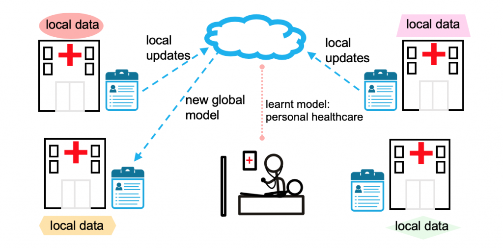

# Heathcare-Federated-Learning

A curated list of Federated Learning papers/resources and recent advancements in Healthcare.

  

##### Table of Contents

1. [Papers](#FL-papers)  
2. [Code](#Code)
3. [datasets](#Datasets)
4. [Tutorials](#Tutorials)
5. [Researchers](#Researchers)

## Papers

- **Federated learning for healthcare informatics**
  - Jie Xu, Benjamin S. Glicksberg, Chang Su, Peter Walker, Jiang Bian, Fei Wang
  - [[Paper]](https://arxiv.org/abs/1911.06270)
  
- **The future of digital health with federated learning**
  - Nicola Rieke
  - [[Paper]](https://www.nature.com/articles/s41746-020-00323-1)
  
- **Federated Learning on Clinical Benchmark Data: Performance Assessment**
  - Geun Hyeong Lee and Soo-Yong Shin
  - [[Paper]](https://www.ncbi.nlm.nih.gov/pmc/articles/PMC7652692/)
  
- **Secure and Robust Machine Learning for Health Care**
  - Adnan Qayyum, Junaid Qadir, Muhammad Bilal, Ala Al-Fuqaha
  - [[Paper]](https://arxiv.org/abs/2001.08103)

[[Image source]](https://blog.ml.cmu.edu/2019/11/12/federated-learning-challenges-methods-and-future-directions/)
